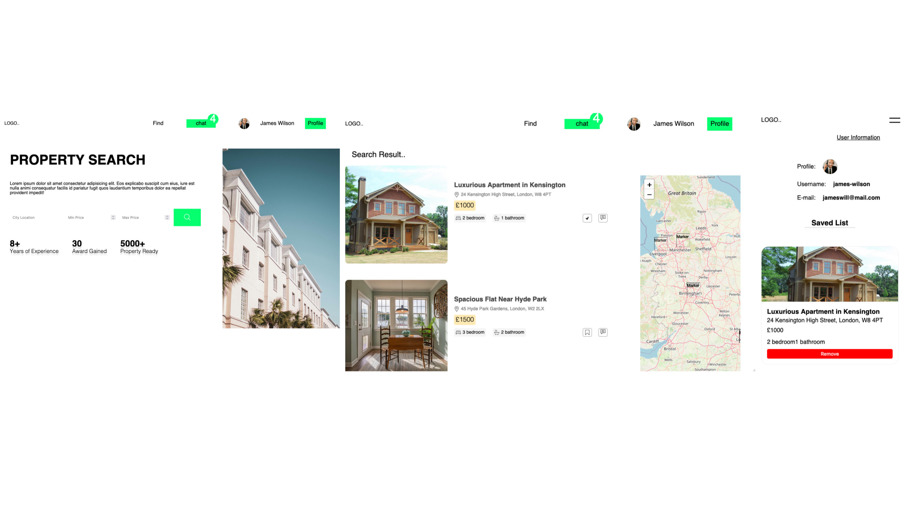

### Description
A mobile-responsive front-end property app built with React and Vite.

### Technologies
- JavaScript
- React
- Sass
- Netlify Deployment

### Live Demo
-  Netlify: https://react-property-app-by-farhad.netlify.app

### Preview


### Getting Started

##### Installation:
1. **Clone the repository**: 
   ```bash
   https://github.com/farhadxf/react-property-app.git

2. Install dependencies:

   - **npm:**
     ```bash
     npm install
     ```
     <button onclick="navigator.clipboard.writeText('npm install')"></button>

   - **yarn:**
     ```bash
     yarn install
     ```
     <button onclick="navigator.clipboard.writeText('yarn install')"></button>


3. Start the development server:

   - **npm:**
     ```bash
     npm run dev
     ```
     <button onclick="navigator.clipboard.writeText('npm run dev')"></button>

   - **yarn:**
     ```bash
     yarn dev
     ```
     <button onclick="navigator.clipboard.writeText('yarn dev')"></button>


#### Author
- [Farhad Hossen](https://farhadx.com)

#### License
This project is open source and available under the [MIT License](LICENSE)